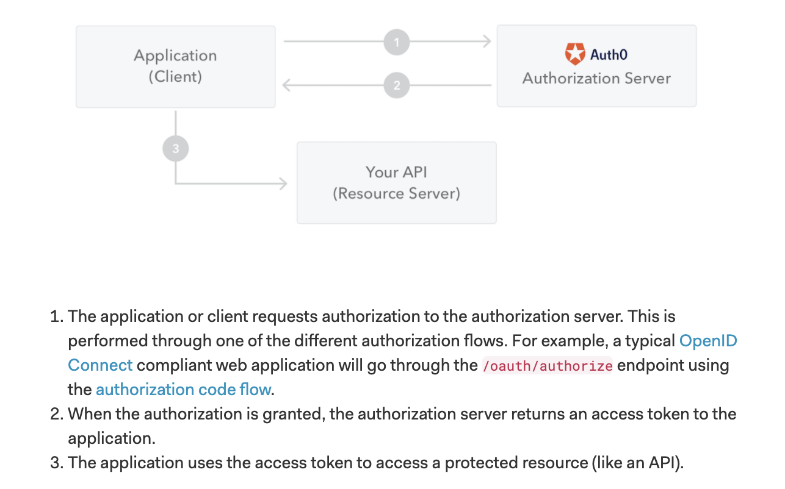

# JWT

✅ JWT(JSON Web Token)

: JSON Web Token (JWT) is an open standard (RFC 7519) that defines a compact and self-contained way for securely transmitting information between parties(Client & Server) as a JSON object. This information can be verified and trusted because it is digitally signed. JWTs can be signed using a secret (with the HMAC algorithm) or a public/private key pair using RSA or ECDSA.

🤔 What Are Tokens?

: To put it simply, a token is a string of data that represents something else, such as an identity. In the case of authentication, a non-JWT based token is a string of characters that allow the receiver to validate the sender’s identity.

🤔 When should you use JSON Web Tokens?

- Authorization

: This is the most common scenario for using JWT

- Information Exchange

: JSON Web Tokens are a good way of securely transmitting information between parties.

🤔 How do JSON Web Tokens work?

: JWTs differ from other web tokens in that they contain a set of claims. Claims are used to transmit information between two parties. What these claims are depends on the use case at hand. For example, a claim may assert who issued the token, how long it is valid for, or what permissions the client has been granted. A JWT is a string made up of three parts, separated by dots (.), and serialized using base64. In the most common serialization format, compact serialization, the JWT looks something like this: xxxxx.yyyyy.zzzzz.

Once decoded, you will get two JSON strings:

1. The header and the payload.
2. The signature.

- The JOSE (JSON Object Signing and Encryption) header contains the type of token. JWT in this case and the signing algorithm.

- The payload contains the claims. This is displayed as a JSON string, usually containing no more than a dozen fields to keep the JWT compact.

- The signature ensures that the token hasn’t been altered.

🤔 Why should we use JSON Web Tokens?

: Let's talk about the benefits of JSON Web Tokens (JWT) when compared to Simple Web Tokens (SWT) and Security Assertion Markup Language Tokens (SAML).

- JSON is less verbose than XML, when it is encoded its size is also smaller, making JWT more compact than SAML.

- Security-wise, SWT can only be symmetrically signed by a shared secret using the HMAC algorithm. However, JWT and SAML tokens can use a public/private key pair

- JSON parsers are common in most programming languages because they map directly to objects. Conversely, XML doesn't have a natural document-to-object mapping.

- Server does not need to keep a database with the information needed to identify the user
